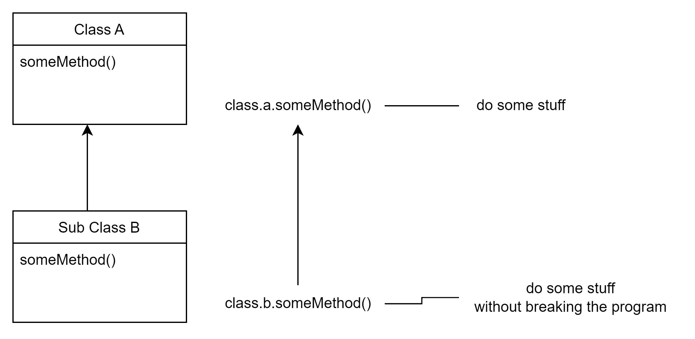

SOLID Liskov substitution principle
===================================
The Liskov substitution principle (LSP) is an object-oriented design principle that states that a subclass must be interchangeable with its superclass without changing the program’s behavior.

That is, if we have a class A and a class B that inherits from A, we can use an object of B where an object of A is expected and the program will still work properly.

Here is an example where we don’t use this principle, that is to say, a bad code implementation. Next, we are going to fix this code to follow this principle.

### Poorly implemented code where we DO NOT use this Liskov substitution principle

Let us use the example with the class _Vehicle_ to demonstrate a misuse of this principle.

We have here our _Vehicle_ class and three subclasses. In the Vehicle class we have added all the methods that a vehicle needs.

    
    class Vehicle {
    
        private String name;
    
        public Vehicle(String name) {
            this.name = name;
        }
    
        public void startMotor() {
            System.out.println("starting motor");
        }
    
        public void accelerate() {
            System.out.println("accelerate");
        }
    
        public void stop() {
            System.out.println("stop");
        }
    
        public String getName() {
            return name;
        }
    }
    
    

Now some types of vehicles, like CombustionVehicle, ElectricVehicle.

    
    class CombustionVehicle extends Vehicle {
    
        public CombustionVehicle(String name) {
            super(name);
        }
    }
    
    
    

    
    class ElectricVehicle extends Vehicle {
    
        public ElectricVehicle(String name) {
            super(name);
        }
    }
    
    
    

Until here, everything looks good, but…

Now we want to add another type of vehicle, a _Bicycle_ (without motor).

But how you can notice, a Bicycle should not have a _startMotor_ method. So, in this class we are going to throw an exception.

**With this class design, we are breaking the substitution principle because we are interrupting the correct behavior of the code.**

Remember:

> Objects of a derived class should be able to replace objects of the base class without breaking the program.

    class Bicycle extends Vehicle {
    
        public Bicycle(String name) {
            super(name);
        }
    
        @Override
        public void startMotor() {
            throw new UnsupportedOperationException("Invalid for Bicycle");
        }
    }
    
    

Call _bicycle.startMotor()_ will throw an error and break the program.

This does not satisfy the principle because if we run it, this method will break the program.

    
    public class Demo {
    
        public static void main(String[] args) {
    
            CombustionVehicle vehicle = new CombustionVehicle("Suv Nissan");
            vehicle.startMotor();
            vehicle.accelerate();
            vehicle.stop();
    
            ElectricVehicle electricVehicle = new ElectricVehicle("Tesla");
            electricVehicle.startMotor();
            electricVehicle.accelerate();
            electricVehicle.stop();
    
            // LSP violation
            // Subtypes must be substitutable for their base types.
            Bicycle bicycle = new Bicycle("BMX Bike");
            bicycle.startMotor(); // This will throw an error. (The subtype is not substitutable by its base class)
            bicycle.accelerate();
            bicycle.stop();
    
        }
    }
    

### How to implement the Liskov substitution principle.

We will arrange this so that the designs of our previous classes comply with this principle.

Let’s fix the class _Vehicle_. We are going to remove the method _startMotor_ because not all vehicles have a motor.

We are going to define a new class _MotorVehicle_ for all motor vehicles and redefine the inheritance.

    
    class Vehicle {
    
        private String name;
    
        public Vehicle(String name) {
            this.name = name;
        }
    
        public void accelerate() {
            System.out.println("accelerate");
        }
    
        public void stop() {
            System.out.println("stop");
        }
    
        public String getName() {
            return name;
        }
    }
    
    

Now the _Bicycle_ class looks like this. This class no longer needs to implement the method _startMotor_. We are not force to throw an error.

    class Bicycle extends Vehicle {
    
        public Bicycle(String name) {
            super(name);
        }
    }
    

Then the parent class for all vehicles with motors. This class is a subtype of vehicle, so also extends from _Vehicle_ class.

    class MotorVehicle extends Vehicle {
    
        public MotorVehicle(String name) {
            super(name);
        }
    
        public void startMotor() {
            // start the motor
        }
    
    }
    
    

Now, all subtypes of _MotorVehicle_ class:

    class CombustionVehicle extends MotorVehicle  {
    
        public CombustionVehicle(String name) {
            super(name);
        }
    }
    

    class ElectricVehicle extends MotorVehicle {
    
        public ElectricVehicle(String name) {
            super(name);
        }
    }
    

Running the program, we can check that it does not break.

    class Demo {
    
        public static void main(String[] args) {
    
            CombustionVehicle vehicle = new CombustionVehicle("Suv Nissan");
            vehicle.startMotor();
            vehicle.accelerate();
            vehicle.stop();
    
            ElectricVehicle electricVehicle = new ElectricVehicle("Tesla");
            electricVehicle.startMotor();
            electricVehicle.accelerate();
            electricVehicle.stop();
    
            // LSP now is satisfied
            // Subtypes must be substitutable for their base types.
            Bicycle bicycle = new Bicycle("BMX Bike");
            bicycle.accelerate();
            bicycle.stop();
    
        }
    
    }
    

Covariance
----------

We should ensure that the method return type overwritten in the subclass is a subtype of the same return type declared in the superclass. This is called Covariance, and it is another rule that we should follow for this Liskov principle.

We are lucky that Java forces this, since it is not possible to return a different type to the one defined in the upper class.

        public abstract class Foo {
            public abstract Number calculateSomething(); 
        }
        
        public class FooSub extends Foo {
    
            // This does not follow the covariance rule, 
            // we should return a number or subtype of number
            // Java does not allow this
            public String calculateSomething() {  // error this does not compile 
                return "hi";
            }
    
            // Correct. Integer is a subtype of Number 
            public Integer calculateSomething() {
                return 123;
            }       
            
        }
        
    

Conclusion
----------

The Liskov Substitution Principle (LSP) promotes modularity and extensibility by allowing the addition of new subclasses without breaking the existing code.

LSP also improves code reusability by allowing superclass behaviors to be inherited and specialized in subclasses.

Furthermore, LSP facilitates polymorphism by allowing different types of objects to be treated interchangeably.

Overall, LSP results in more modular, reusable, and flexible code, making it easier to enhance and maintain software systems.